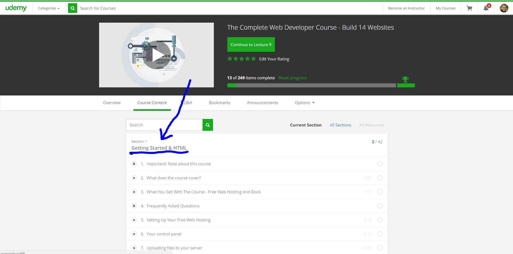
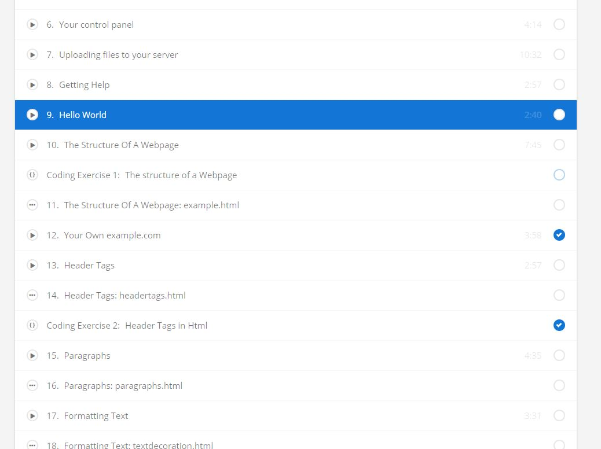
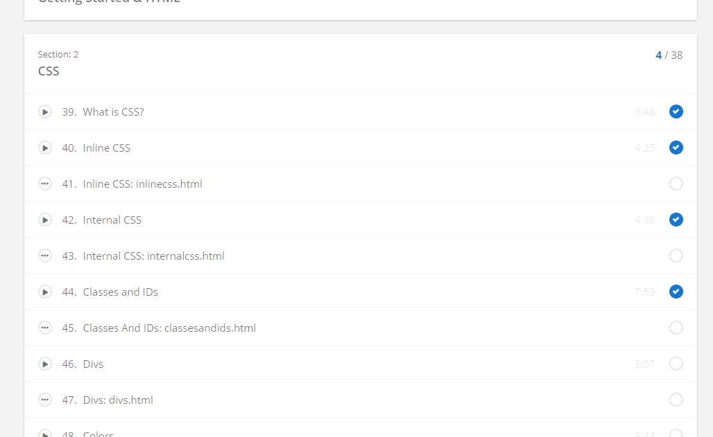

# Learning `HTML` and `CSS`

You are learning `HTML` and `CSS`, because its the basics. If you were going to learn art, you wouldn't start with a painting a Picasso painting, you would first learn the basics. The same thing goes for programming. You aren't going to begin by building a complicated website. You will first learn to build small parts of a website. After you build those components, you will then combine them altogether to have a final app. This way, you progressively learn how to build the app.

`HTML` and `CSS` can be related to building a house. With a house, you first put up the walls and built the layout and structure of the house. This is `HTML`. It will build the layout of the app. It will say where things go. After you build the structure of the house, you put up all the sheetrock and decorate the house. `CSS` will help you "paint" and "decorate" your app. It makes the website look pretty.

Now that you understand why we learn these two first, lets Begin. You will go through videos on `Udemy` online. `Udemy` is a learning website. I already paid for a course to learn the basics. Access it with the username and password I gave you. 

## Step 1 - Learn `HTML`

Click on this [link](https://www.udemy.com/join/login-popup/?next=/complete-web-developer-course/learn/v4/content) and it will ask you for that username and password. After you login, it will take you to this page:

  

  

As you can see, the image shows the first section, `Section 1: Getting Started and HTML`. However, scroll down the page and start with the video called `9. Hello World` (see image). You can click on [this link](https://www.udemy.com/complete-web-developer-course/learn/v4/t/lecture/1232724?start=0) to go directly to that video.

  

  

This is where the teacher teaches you `HTML`. Go through all the videos in `Section 1` (Videos `9`-`38`). As you go through the videos, it would be helpful to follow along and even code with him as you do it.

## Step 2 - Learn `CSS`
Once you are completed with `Section 1`, go to `Section 2: CSS`:

  

  

Go through all those videos (videos `39`-`75`) Feel free to do the quizzes he has on there. It will help you review the most important parts.

**Message me when you have completed these.** This means you are ready for a session with me. In the session, we will decide on an app you want to build. So prepare ahead of time and think of ideas. But by that time, if you can think of one, then we will use a website to copy (use as a reference that will help you learn the basics).
